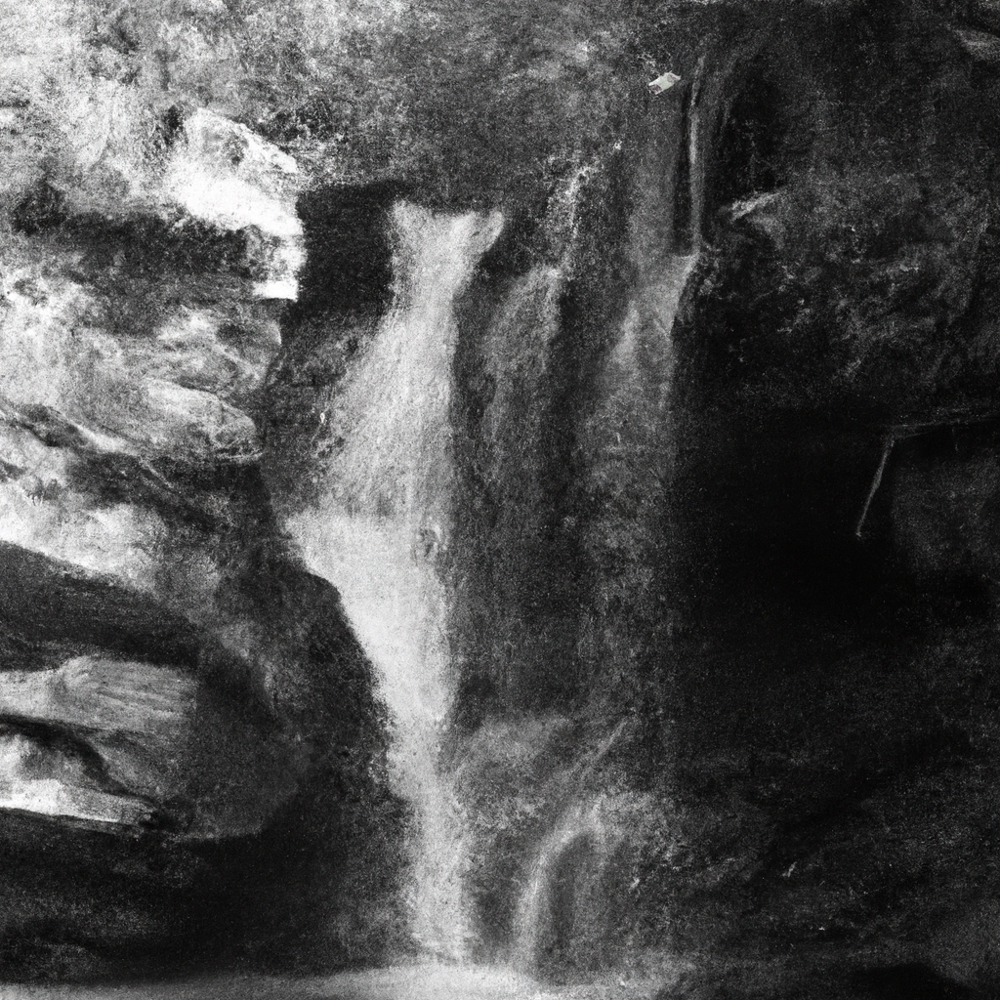

)

Upon the cliffs of majesty, I stand,
Where rugged shores embrace the roaring sea,
A witness to the timeless, primal grand,
That echoes through the ages, wild and free.

The seagulls soar with wings that brush the sky,
As ocean waves, with thunderous applause,
Crash against the cliffs, where echoes vie,
To reach the heavens with their ancient cause.

In solitude, the cliffs proclaim their might,
Enduring storms and tides that ceaseless churn,
A stoic stance against the day and night,
As centuries in limestone scars are worn.

Oh, cliffs of majesty, your presence reigns,
Where nature's power and beauty merge and wane.