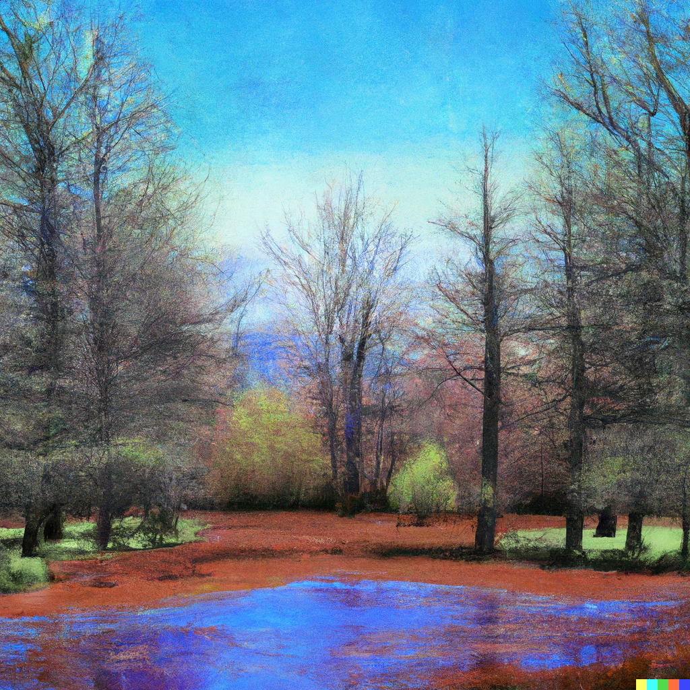

Amidst the ancient woods, a symphony,
Where towering trees compose a song of green,
Their leaves and branches swaying gracefully,
In harmony, a timeless masterpiece unseen.

The whispers of the wind among the leaves,
A melody that dances through the glade,
And as the sunlight filters through the trees,
A gentle cadence in the shadows laid.

The woodland creatures join the grand refrain,
With chirping birds and rustling critters' feet,
A symphony of life, a wild refrain,
Where nature's rhythms blend and sounds compete.

Within this forest's realm, my soul is stirred,
A symphony of life, where I am heard.