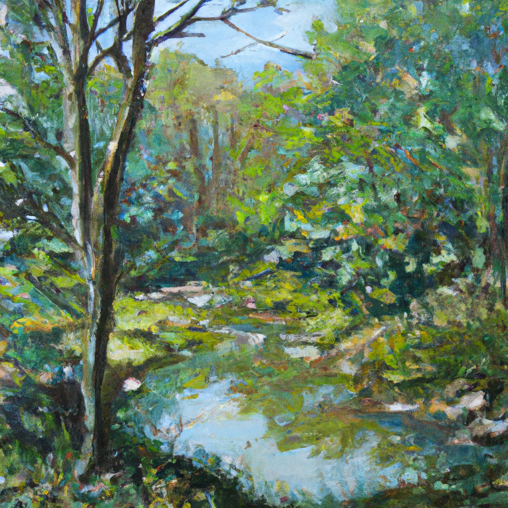

Amidst the meadows dressed in blooms arrayed,
Where gentle zephyrs kiss the petals fair,
A tapestry of colors softly laid,
Inviting hearts to breathe the scented air.

The sun, a warm and golden spotlight's gleam,
Caresses every blade of grass it meets,
And as the flowers sway in gentle dream,
Life's fleeting beauty humbly it entreats.

The buzzing bees, a choir's symphony,
Proclaiming life's sweet dance and melody,
With each caress of soft wind's rhapsody,
Nature's serenity sets spirits free.

Amongst these meadows, I find my repose,
Where nature's symphony forever flows.

