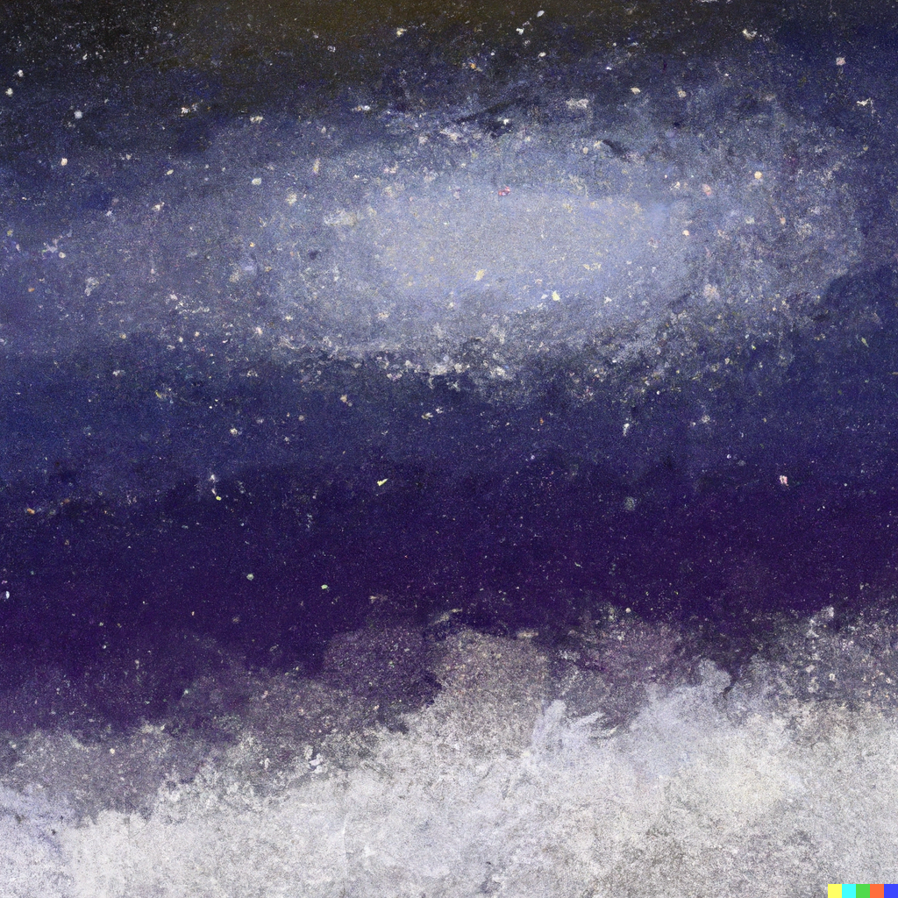

In the vast expanse of starlit skies,
Where constellations weave their tales above,
A cosmic orchestra, a grand surprise,
Plays melodies of wonder and of love.

The moon, a luminescent guiding light,
Illuminates the symphony of stars,
In harmonies that shimmer through the night,
Creating dreams that reach beyond the bars.

Beneath this celestial canopy's dome,
I feel the universe's gentle call,
A song of unity, where souls may roam,
In cosmic dance, we rise and never fall.

Oh, celestial symphony divine,
In your embrace, eternity we find.

2. Meadows of Serenity

Amidst the meadows dressed in blooms arrayed,
Where gentle zephyrs kiss the petals fair,
A tapestry of colors softly laid,
Inviting hearts to breathe the scented air.

The sun, a warm and golden spotlight's gleam,
Caresses every blade of grass it meets,
And as the flowers sway in gentle dream,
Life's fleeting beauty humbly it entreats.

The buzzing bees, a choir's symphony,
Proclaiming life's sweet dance and melody,
With each caress of soft wind's rhapsody,
Nature's serenity sets spirits free.

Amongst these meadows, I find my repose,
Where nature's symphony forever flows.