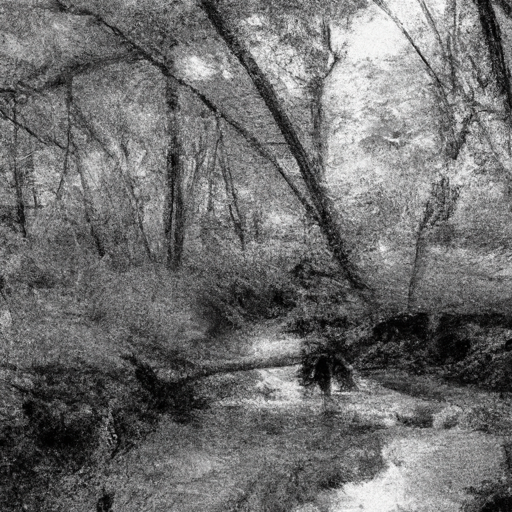

Beside the winding river's gentle flow,
Where waters rush and secrets lie within,
I hear a melancholic undertow,
A lament whispered softly to begin.

The river's tale of sorrow and delight,
Carved in the canyons by its tender touch,
Reflects the day and night's eternal fight,
As life and time weave patterns that mean much.

The ripples tell of stories left untold,
Of ancient forests, spirits long since passed,
Yet, in their song, a promise to uphold,
The circle of existence that will last.

Beside the river, I find solace deep,
Its soothing voice, a lullaby to keep.

