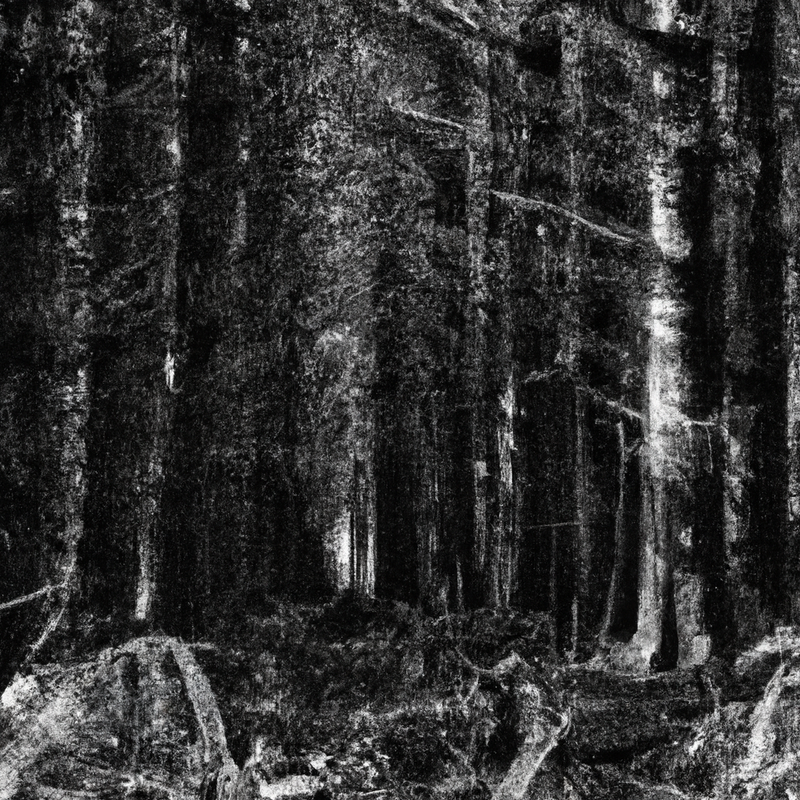

Beneath the towering canopy of green,
Where redwoods stretch their arms towards the skies,
I find a sacred place, a hidden scene,
Where nature's ancient secrets gently rise.

Among the dappled light and forest floor,
A symphony of life begins to play,
And as I wander through this wooded door,
I feel the essence of a bygone day.

The murmurs of the breeze amidst the leaves,
A gentle touch that stirs the heart and soul,
A harmony of life that never grieves,
Where wilderness and peace together stroll.

In twilight's hush, I find my spirit's ease,
Embraced by redwoods' whispers and their pleas.