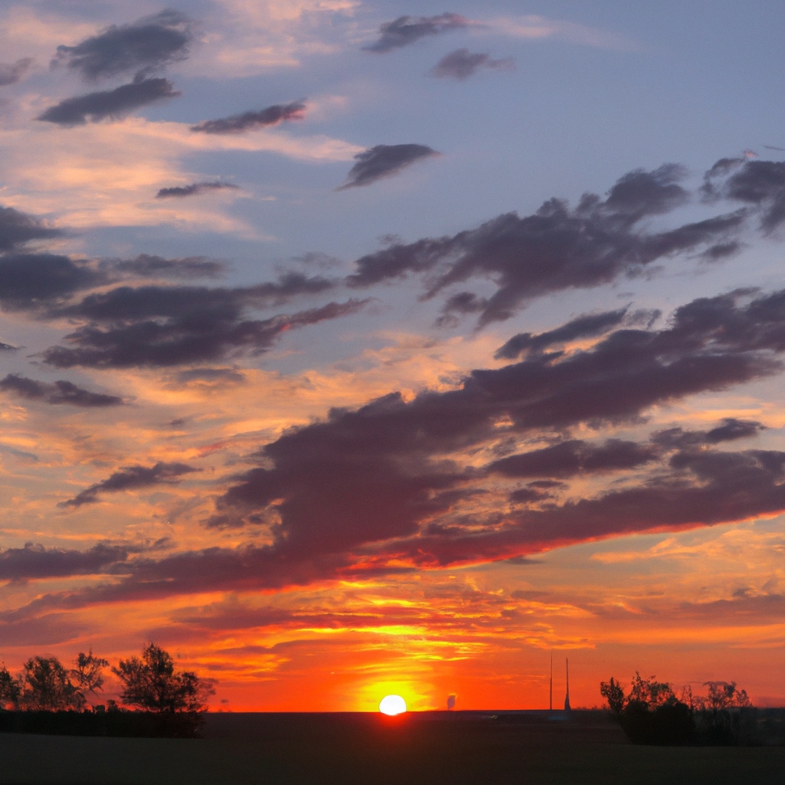

Amidst the desert's vast and arid land,
Where sands extend to meet the horizon,
A song of solitude, the shifting sand,
Whispers tales of ancient times and cries on.

Beneath the stars that twinkle in the night,
The desert wind's soft voice begins to rise,
Its melody, a beacon of the light,
Guiding weary souls through endless skies.

In golden hues, the sun bids its farewell,
The desert symphony takes center stage,
A timeless dance where echoes seem to dwell,
In tranquil dunes, life's mysteries engage.

In solitude, the desert's voice I hear,
Its serenade, a solace far and near.