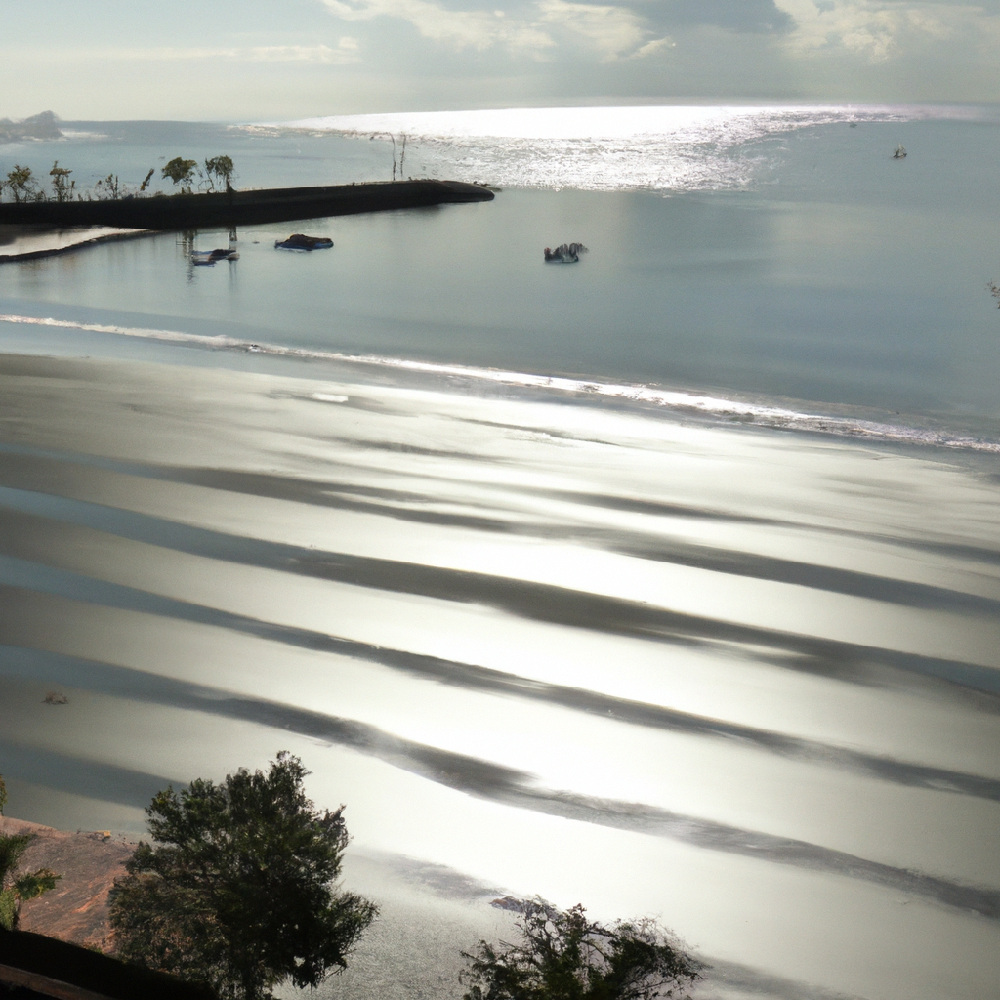

Amidst the ceaseless surge of waves and foam,
Upon the granite shore, I stand alone,
As seagulls' cries echo in the vast dome,
And rugged cliffs to winds of fate intone.

Nature's vast canvas, painted by the seas,
A tumultuous symphony of might,
Where solitude grants me my soul's release,
In quiet contemplation, day or night.

The ancient rocks, with stories etched in stone,
Bear witness to the eons that have passed,
As time, like water, carves its patient tone,
And sands of fate within the hourglass.

The stars above, a glimmering array,
Illuminate the mysteries unknown,
As whispers of the universe convey,
The grand design where man is not alone.

O rugged shore, your beauty strikes my core,
Your splendor and your harshness intertwine,
Infinite truths and secrets you store,
Where man can glimpse eternity divine.

And as the waves recede and then return,
In cycles unending, never still,
I learn from you, the wisdom that I yearn,
To find my place, surrender to your will.

Upon the granite shore, I'll stand my ground,
With wind and salt, in nature's fierce embrace,
In awe and reverence, I am spellbound,
An humble observer of your grace.