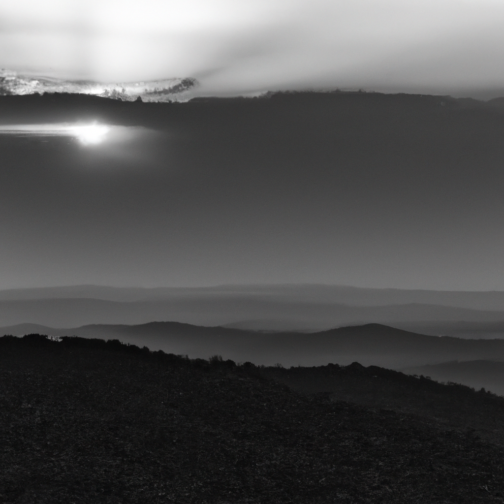

In the heart of wild and rugged shores,
Where waves crash with a deafening roar,
Nature sings her ancient lullaby,
As the golden sun sets in the sky.

The granite cliffs rise high and proud,
Where cormorants roam, with wings unbowed.
Majestic sentinels, they stand,
Against the winds that sweep the land.

The sea, restless mistress of the deep,
Slowly erodes the cliffs, a secret to keep,
Tantalizing whiffs of briny air,
A reminder of her wrath, so fierce and fair.

With each passing day, the sea unveils,
A tale of courage, death, and prevailing sails.
The tempests rage, the ships they claim,
But life goes on, forever the same.

Pebbles dance along the sandy floor,
Carried by the currents, to distant shores,
Witness to the passage of time,
And the eternal rhythm of nature's chime.

The wildflowers cling to cliffs' mighty walls,
Defying gravity's alluring calls.
Their vibrant hues, a vivid display,
Of resilience against nature's sway.

The ancient oaks, with roots intertwined,
Survivors of storms, their branches defined,
Reaching toward the sky, towards the light,
A testament to endurance, through day and night.

Nature is a symphony, sublime and grand,
A tapestry weaved by an unseen hand,
With winds as maestros, and waves as choir,
A harmonious ode to the earth's entire.

So, let us pause and heed nature's plea,
With reverent eyes, pure and unbound glee.
For in her embrace, we find our place,
A gentle reminder of our own grace.