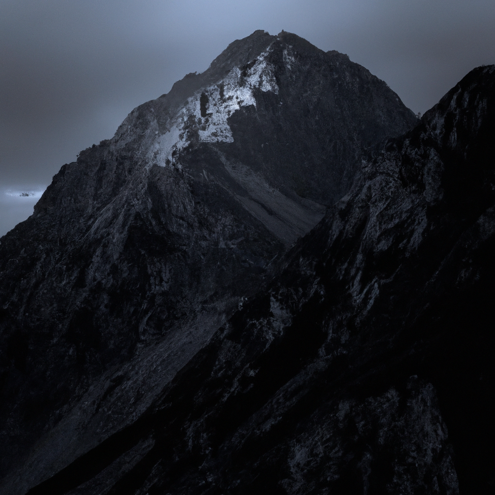

In the tangled wilderness I venture deep,
Where sullen echoes resonate, and shadows creep.
An ancient throne of granite jeweled with moss,
A sentinel of nature's realm, majestic and grandiose.

Mighty seas crash upon the rugged shore,
Whispering tales of forgotten lore.
Gulls screech, their cries carried on the wind,
As the sun's golden rays begin to rescind.

The verdant forest holds secrets untold,
Its emerald canopy begging to be extolled.
Luminous rays pierce the verdant veil,
As ancient oaks dance beneath a starry hail.

A waterfall cascades with thunderous might,
Reverberating through the canopy's height.
The ethereal mist, with droplets like pearls,
Enchants the air, while nature unfurls.

A chorus of songbirds fills the soft breeze,
Their melodies charming those who seize
This fleeting moment, a glimpse into the wild,
Where harmony and discord are reconciled.

In this sanctuary, untouched by human lands,
I find solace and purity, like shifting sands.
For nature's realm is a sacred retreat,
A sanctuary where my soul finds complete.