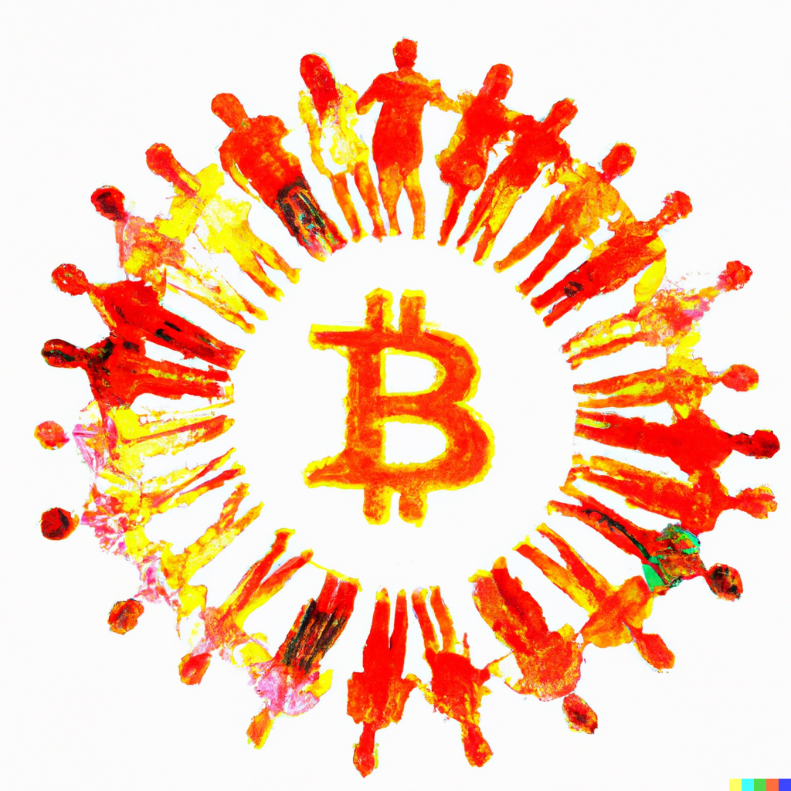

As I write, the crypto world is undergoing another shockwave with Silvergate announcing its bankruptcy and closing. The collapse of FTX and other crypto scandals this year suggests that far from being the remedy to the problem of centralized money, the current trajectory of the industry is to replicate Wall Street with its appetite for short term profits and shadowy backdoor deals. This is not inevitable. Blockchain technology offers the potential for a new world of collaboration, radical transparency and distributed prosperity for all of us. The future depends on our ability to build social institutions that leverage the technology for its full potential instead of simply replicating traditional financial institutions. I’d like to explore some ways that this could happen with a focus on how artists could play a large role in the future of blockchain technology.

NFT’s have already upended the art world. In under a decade, [NFTs have grown to make up 16% of the global art market](https://ocula.com/magazine/art-news/nfts-now-constitute-16-percent-of-the-art-market/). By creating and selling NFTs, artists have been able to reach a wider audience, and earn more income from their work, without the need for traditional intermediaries, like galleries or auction houses. NFT marketplaces like [OpenSea](https://opensea.io/), [Rarible](https://rarible.com/), and [Nifty Gateway](https://www.niftygateway.com/), have already empowered a new generation of artists worldwide, who otherwise would have been barred from participating in the gallery system. This already represents incredible progress in an industry that is notorious for its conservatism, but I think it's time that the NFT revolution be taken even further. 

It's time for the  re-emergence of art communities. Many famous artists throughout history have lived and worked in communities with other artists. From [Black Mountain College](https://en.wikipedia.org/wiki/Black_Mountain_College), to [LaMama](https://en.wikipedia.org/wiki/La_MaMa_Experimental_Theatre_Club), to [Drop City](https://en.wikipedia.org/wiki/Drop_City), artists have always found it useful to form communities that provide a space for artists to collaborate, learn from each other, and share resources. With the high cost of living in many cities, competition with traditional art galleries, and the limited audience available to brick and mortar institutions, forming these communities in the past has been challenging. Blockchain technology could be the solution for some of these problems.

A DAO (Decentralized Autonomous Organization) is an organization that operates on a blockchain network, where decisions are made through a decentralized consensus mechanism instead of a central authority. Members of a DAO can vote on proposals, participate in governance, and receive rewards based on their contributions. DAOs are typically governed by smart contracts and allow for transparent and decentralized decision-making. DAOs have enabled quick effective collaboration across national boundaries for a myriad of projects from community organizing to funding research and development. Some of the most remarkable accomplishments of DAOs include the creation of digital public goods like [open-source software](https://www.gitcoin.co/#history) and the funding of [public infrastructure projects](https://decrypt.co/resources/what-is-moloch-dao-funding-public-goods-ethereum-ecosystem). DAOs have also been used to launch successful startup companies and invest in emerging technologies. The flexibility and autonomy of DAOs have made them a promising tool for decentralized governance and collaborative decision-making in a variety of fields.

The radically democratic structure of a DAO would be ideal for an art collective. Smart contracts could be used to automate the process of raising and distributing funds. Artists could form their own NFT exchanges allowing artists to keep 100% of the profit from their work. A new generation of art collectives empowered by the reach of a global marketplace, aided with the security and transparency made possible by blockchain technology, could outpace the traditional gallery system. Artists could collaborate, share resources, housing, education materials, establish residencies, and protect their work while selling to the largest art market available in world history.

Important work is already being accomplished in this domain. [Metaversal](https://www.metaversal.gg/) is a decentralized platform that offers a range of services to artists in the NFT space, helping them to promote their work and connect with collectors. The platform provides tools for artists to mint and sell their NFTs, as well as features for showcasing their art and building their fanbase. Additionally, Metaversal offers support for artists through mentorship programs, grants, and community events. By providing a range of services and resources to artists, Metaversal aims to empower creators in the NFT space and foster a more equitable and collaborative art ecosystem.

[Flamingo DAO](https://flamingodao.xyz/) is a decentralized autonomous organization that invests in NFTs and digital art. The organization offers financial support to artists, helping them to create and distribute their work in the NFT space. Flamingo DAO also provides resources for artists to learn about the NFT market, connect with collectors and collaborators, and gain exposure for their work. By supporting artists in the NFT space, Flamingo DAO is helping to drive innovation and growth in the art world while promoting greater democratization and decentralization of the art market.

Blockchain technology offers a wide range of opportunities for artists looking to collaborate and form communities to support their work. The decentralized and transparent nature of blockchain allows for seamless management of creative assets and equitable distribution of rewards among members. By leveraging smart contracts and non-fungible tokens, artists can establish a fair and secure system that ensures their work is protected and their contributions are acknowledged. As blockchain technology continues to evolve and gain mainstream adoption, it is likely that we will see more and more artists using this technology to unite and take their creativity to new heights.

I hope to see a future filled with decentralized crowd-sourced funding of art projects more ambitious than the world has ever seen before. I hope that the world of crypto abandons the bad habits of traditional finance with its propensity for fraud, deception, and economic abuse. Most importantly, I hope that successful social experiments in decentralized governance demonstrate the possibilities of blockchain technology so that other industries habitually controlled by top-down centralized hierarchies will be encouraged to explore other alternatives. 

