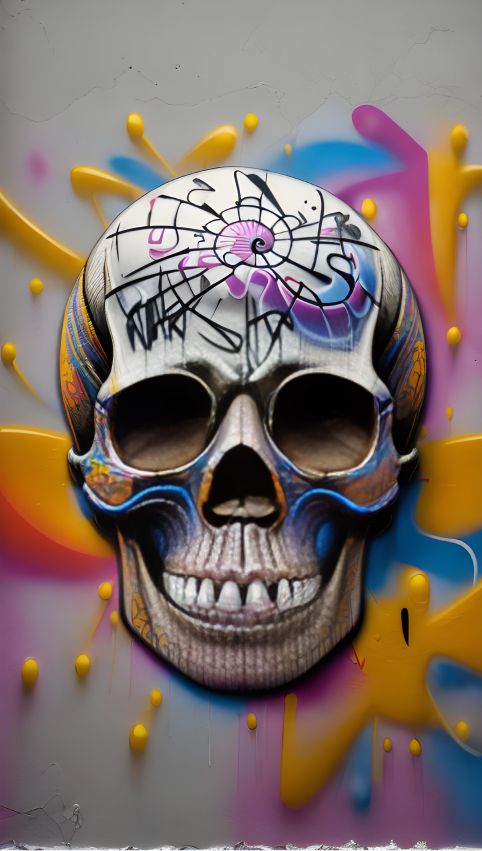

Title: The Day of the Dead Celebrations for Gen Z: Embracing Tradition in a Digital Age

Introduction:
The Day of the Dead, or Dia de los Muertos, is a vibrant and colorful Mexican celebration that honors and remembers deceased loved ones. Traditionally rooted in Mexican culture, this ancient holiday has transcended borders and found resonance among the younger generation, particularly Gen Z. This essay explores how Gen Z embraces and reinterprets the Day of the Dead celebrations, combining their affinity for technology, cultural inclusivity, and social consciousness to create a unique blend of tradition and modernity.

A Digital Evolution:
Gen Z, the first generation to grow up in a fully digital age, has embraced technology as a means of self-expression and cultural exploration. For Day of the Dead celebrations, Gen Z incorporates social media platforms, virtual communities, and digital art to share their experiences, connect with others, and showcase their creativity. The digital realm provides an avenue for this generation to celebrate and share their interpretations of the holiday on a global scale.

Cultural Inclusivity:
Gen Z is known for its commitment to inclusivity and diversity, seeking to understand and appreciate different cultures. The Day of the Dead has captured their attention as a celebration that invites people of all backgrounds to honor their departed loved ones. Gen Z's embrace of cultural inclusivity enables them to participate in Day of the Dead festivities, fostering cross-cultural understanding and appreciation.

Reimagining Tradition:
While rooted in ancient traditions, Gen Z brings a fresh perspective to Day of the Dead celebrations. They incorporate contemporary symbols, art forms, and music into the festivities, infusing the holiday with their unique aesthetic. Gen Z's creativity and willingness to reinterpret traditions breathe new life into the celebration, making it more accessible and relatable to their generation.

Social Consciousness and Remembrance:
Gen Z is known for its strong social consciousness and desire to make a positive impact. The Day of the Dead provides an opportunity for them to remember not only their own loved ones but also victims of social injustices, natural disasters, or systemic inequalities. Gen Z's commemoration extends beyond personal connections, as they use the holiday as a platform for activism, raising awareness, and advocating for change.

Preserving Ancestral Connections:
In an increasingly fast-paced and interconnected world, Day of the Dead celebrations offer Gen Z a moment to reconnect with their ancestral roots and honor the legacies of their ancestors. They engage in activities such as creating altars, cooking traditional foods, and participating in community events that foster a sense of belonging and continuity with their cultural heritage.

Conclusion:
The Day of the Dead celebrations have found a renewed relevance and resonance among Gen Z, thanks to their affinity for technology, cultural inclusivity, and social consciousness. Through the digital realm, Gen Z embraces and reinterprets this ancient tradition, weaving it into their modern lives and sharing their experiences with a global audience. By honoring their departed loved ones, engaging in cross-cultural understanding, and using the holiday as a platform for social activism, Gen Z brings a fresh perspective to the Day of the Dead, ensuring that its essence endures and evolves for generations to come.