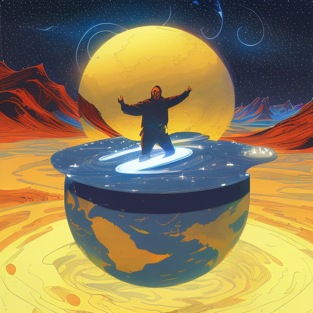
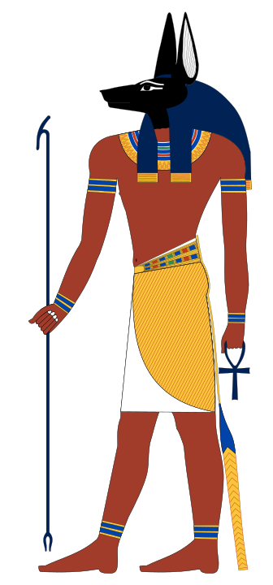
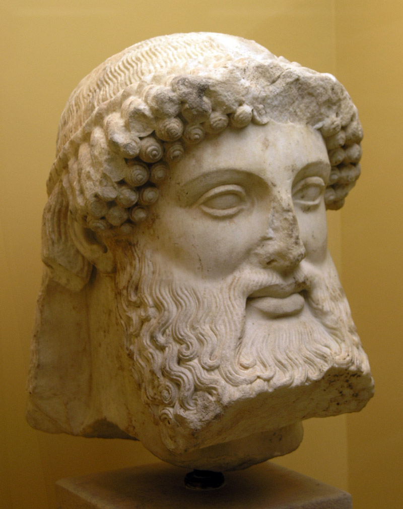
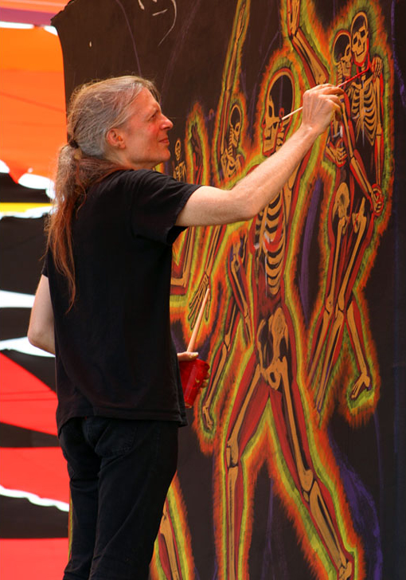

> Those who leave the womb at birth
> and those who enter their source at death,
> of these; three out of ten celebrate life,
> three out of ten celebrate death,
> and three out of ten simply go from life to death.
> What is the reason for this?
> Because they are afraid of dying,
> therefore they cannot live. 

> -Tao Te Ching

Art is about Transcendence. Effective artistic expression pushes us beyond the limits of ordinary perception and understanding not unlike a mystical experience. These powerful emotional and aesthetic encounters transport us beyond our immediate reality into a space beyond the boundary of self and other. In a world starved for spirituality, it has never been more important for us to step outside the humdrum of daily existence into that part of ourselves that connects with the Cosmos. Art grants meaning to life and death unlike any other human endeavor.

The modern world is in crisis. Hopelessness and cynicism have become our psychic baseline. Never before has humanity had so much power, and so little desire to do anything with it. The religions and belief systems that inspired our ancestors are dead. The psychological fallout from this reality surrounds us in the form of new pseudo-religious ideologies being born daily. From flat earthers, to QAnon, to the emergence of [Tiktok cults](https://www.vice.com/en/article/5db358/heres-what-happened-at-the-tiktok-commune-the-garden-after-it-closed-tree-julia-interview), humanity is hungry for something to replace the old systems of meaning destroyed by the age of Reason.

During times of radical change and social upheaval it has been the duty of artists to rescue culture from spiritual nihilism and provide a vision to carry civilization into the future. It’s with this goal in mind that I’m creating Psych0p0mp, a digital journal celebrating psychedelic art and alternative spirituality. Leading up to its launch, I will be posting short essays exploring some of the themes soon to be featured in the journal. In this blog post I’d like to start by explaining the name.

A psychopomp is a spiritual being responsible for guiding the newly deceased into the afterlife. It is a concept that reoccurs in ancient mythology throughout all world cultures. In ancient Egypt this role fell to Anubis. He was commonly depicted as a jackal-headed figure, portrayed as a protector of graves and a guide for the dead on their journey into the afterlife. The ancient Egyptians believed that the soul consisted of several parts, including the ka, ba, and akh. After death, the ka and ba were believed to leave the body and journey to the underworld, where they would be judged by a tribunal of gods, including Anubis. Anubis was responsible for weighing the heart of the deceased against the feather of Ma'at, taken from the goddess of truth and justice. If the heart was found to be lighter than the feather, the soul would be allowed to enter the afterlife. If the heart was heavier, it was believed that the soul had lived a wicked life and would be devoured by Ammit, the devourer of souls.

Yama is the psychopomp of Hindu mythology. He is regarded as the god of death, the lord of justice, and the ruler of the underworld. He is often depicted as a dark, skeletal figure riding a buffalo, and carrying a noose and a mace. Similar to Egyptian symbolism, a scale is used to weigh a soul’s deeds and determine its fate after death. If the soul has lived a righteous life, it is allowed to enter Svarga, the realm of the gods. If the soul has lived an unrighteous life, it is sent to Naraka, the realm of punishment. In stark contrast with Judeo-Christian conceptions of the underworld, while associated with death, Yama is not regarded as evil. In the Katha Upanishad, Yama serves in the capacity of guru for the young boy, Nachiketa, guiding him on the path to enlightenment and the transcendence of death.

Another common motif in psychopomp lore is the figure of the ferryman. In Greek mythology, the psychopomp figure was split between Hermes and his ferryman Charon. Hermes was known as the messenger of the gods, and the god of commerce, thieves, and travelers. He was often depicted as a youthful figure with wings on his sandals and hat, which allowed him to move swiftly between the realms of the living and the dead.  He and Charon were believed to be responsible for leading the souls of the dead across the river Styx to reach their final destination in the afterlife. This myth led to the emergence of a common funeral rite known as “Charon’s Obol”,  in which a coin was placed into the mouth of the deceased to pay for safe passage into the afterlife. Many believe that the practice of administering the Eucharist to the dying is a Catholic adaptation of this ancient pagan practice.

The myths of our ancestors were intended to be tools of self-reflection. Today social media, reality television, celebrity worship, limitless consumption, and the endless pursuit of money crowds out most opportunities for introspection. And yet, we live with the same reality as our ancestors, at the end of life the only thing that will matter is the experiences that we had while we were alive, and the legacy created by our actions. Modern culture blinds us from this fact for obvious reasons. We live in a culture of superficiality and alienation, in which people are disconnected from themselves, from each other, and from the world around them. Our lives are intended to be a string of empty consumerist experiences. The legacy that we are leaving behind for future generations is one of environmental degradation, rampant inequality, and a social climate of chronic anxiety and depression. Future generations will weigh the heart of our culture and find it empty of justice and truth. Our story will be one of great potential squandered because of an inability to find inspiration outside of short-term profit, cheap entertainment, and market fads.

I truly believe that only art can save us. In an era deprived of any space for contact with the Divine, artistic expression is our only remaining avenue for the creation of ultimate meaning. Art, in its proper context, forces us to confront our individual internal psychic landscape. It’s our culture's only outlet for struggling with the ultimate issues of human experience, life and death, war and peace, love and hate, pain and ecstasy. It opens the transcendent dimension of our psyche for unmediated confrontation with the Sublime. Creative expression must become our psychopomp, ushering us from the earthly plane into a Sacred dimension where we make contact with the Infinite. The role of the artist must become that of a prophet, allowed to question our societal norms and seek meaning where our culture only envisions death. Psychedelic art is the most honest realization of this calling. It roots itself in entheogenic and meditative experience aiming to communicate and impart to an audience the most interior of subjective experiences. It challenges each individual to look within themselves to determine existential significance. It reminds us to experience life as a numinous journey with each moment a potential gateway to the Oneness of all life.

Psych0p0mp is a project devoted to the promotion of psychedelic art and its ability to heal a fractured world. I hope to make it a platform for voices that challenge the dominant cultural paradigm of our time, and offer fresh perspectives on spirituality and art speaking honestly to our post-Truth era. In future posts I will feature the work of artists across a variety of mediums, both famous and obscure, who challenge the empty Zeitgeist of our times. I’m eager to hear from anyone who is sympathetic with this vision and would like to contribute illustrations, essays, commentary, suggestions, or criticism. I can be contacted via [email](mailto:justgnnr@gmail.com) or [Twitter](https://twitter.com/justgnnr).

