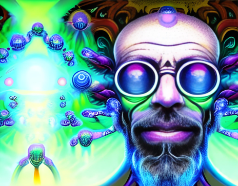

In recent years, there has been a growing interest in the therapeutic potential of psychedelic drugs for psychiatric treatment. These substances, known for their mind-altering effects, are being reevaluated as promising tools to address mental health conditions that have proven challenging to treat with traditional approaches. This essay examines the rise of psychedelic drugs in psychiatric treatment, exploring their history, current research, potential benefits, and the challenges they present in terms of legality, safety, and ethical considerations.

Psychedelic drugs, such as psilocybin (found in certain mushrooms), LSD (lysergic acid diethylamide), and MDMA (methylenedioxymethamphetamine), gained popularity in the 1960s before being classified as Schedule I substances due to their potential for abuse. However, recent scientific and clinical studies have rekindled interest in their therapeutic use, leading to a resurgence in research and clinical trials.

Contemporary research on psychedelics for psychiatric treatment focuses on various conditions, including depression, anxiety disorders, post-traumatic stress disorder (PTSD), addiction, and existential distress in patients with life-threatening illnesses. Preliminary studies suggest that these substances may offer unique therapeutic benefits, such as promoting neuroplasticity, enhancing emotional processing, and facilitating introspection and insight.

Psychedelic-assisted therapy has shown promise in providing breakthrough experiences, catalyzing transformative insights, and promoting psychological healing. Patients report enhanced emotional awareness, increased acceptance, and a sense of connectedness that may facilitate long-lasting positive changes in behavior and mental well-being. Moreover, the short-term effects of these substances often lead to decreased depressive symptoms, reduced anxiety, and improved mood regulation.

Despite the potential therapeutic benefits, the use of psychedelic drugs in psychiatric treatment faces several challenges. Legal restrictions and societal stigmatization impede research and hinder access to these treatments. Safety concerns exist, particularly regarding dosage, administration, and potential adverse effects, requiring comprehensive risk-benefit assessments. Ethical considerations, such as informed consent, patient screening, and integration of experiences, must be carefully addressed to ensure responsible and ethical implementation.

The integration of psychedelic drugs into mainstream psychiatric care necessitates rigorous scientific research, evidence-based protocols, professional training, and regulatory frameworks. Efforts are underway to establish guidelines and regulations to ensure safe and ethical use. Collaborations between researchers, clinicians, policymakers, and the pharmaceutical industry are essential to navigate these complexities and facilitate responsible integration into psychiatric practice.

The resurgence of psychedelic drugs for psychiatric treatment holds immense potential in addressing the unmet needs of individuals with mental health conditions. As research advances, the therapeutic benefits of these substances become increasingly evident. However, navigating the challenges surrounding legality, safety, and ethical considerations is crucial. By fostering responsible research, promoting public awareness, and ensuring comprehensive regulations, we can maximize the therapeutic potential of psychedelic drugs while safeguarding patient well-being, thereby potentially revolutionizing psychiatric care and offering new avenues for healing and transformation.
