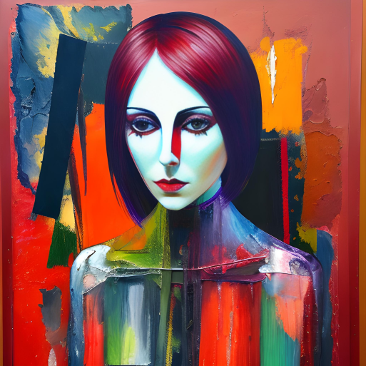

Artistic movements have always evolved in response to technological advancements and societal shifts. With the rise of hyper-realistic A.I. art, there is an opportunity for abstract expressionism, a movement rooted in the exploration of emotion and subconscious, to regain popularity. This essay delves into the potential resurgence of abstract expressionism in the context of hyper-realistic A.I. art, examining how the two can coexist and complement each other, offering new avenues for artistic exploration and human connection.

Hyper-realistic A.I. art has captured the imagination of both artists and audiences, as algorithms generate images that mimic reality with astounding precision. This technological advancement has pushed the boundaries of artistic creation and challenged traditional notions of what constitutes art. The hyper-realistic A.I. art movement primarily focuses on replicating the visible world, prioritizing technical accuracy and detail.

Abstract expressionism, on the other hand, emerged in the mid-20th century as a rebellion against representational art. Artists sought to convey emotions, ideas, and personal experiences through non-representational forms, emphasizing the power of color, gesture, and texture. Abstract expressionism invited viewers to interpret and engage with art on an emotional and subconscious level, breaking away from the constraints of realism.

While hyper-realistic A.I. art excels at recreating the visible world, abstract expressionism invites viewers to explore the intangible aspects of human existence. The emergence of hyper-realistic A.I. art does not render abstract expressionism obsolete; rather, it opens up new possibilities for artistic exploration. The juxtaposition of the hyper-real and the abstract creates a dialogue that can challenge perceptions and broaden artistic horizons.

In an increasingly digital world, where screens mediate our experiences, there is a growing need for art to reconnect us with our emotions and humanity. Abstract expressionism, with its emphasis on individual interpretation and emotional resonance, can offer a counterbalance to the hyper-realistic A.I. art's focus on technical precision. It invites viewers to explore their own inner landscapes, fostering introspection, empathy, and personal connections.

While hyper-realistic A.I. art relies on algorithms and computational power, abstract expressionism celebrates the human touch, spontaneity, and imperfections. It reminds us that art is not solely about replicating reality but also about capturing the essence of the human experience. Abstract expressionism allows artists to transcend the limitations of technology, expressing the ineffable and encouraging viewers to find meaning beyond the surface.

The rise of hyper-realistic A.I. art presents an exciting opportunity for the resurgence of abstract expressionism. These two artistic realms, seemingly at odds, can coexist and complement each other, expanding the horizons of artistic exploration and deepening human connection. As technology advances, it is essential to remember that art is not solely about replicating reality but also about evoking emotions, challenging perceptions, and fostering personal connections. The resurgence of abstract expressionism can serve as a powerful reminder of the enduring power of human expression in the face of technological progress.