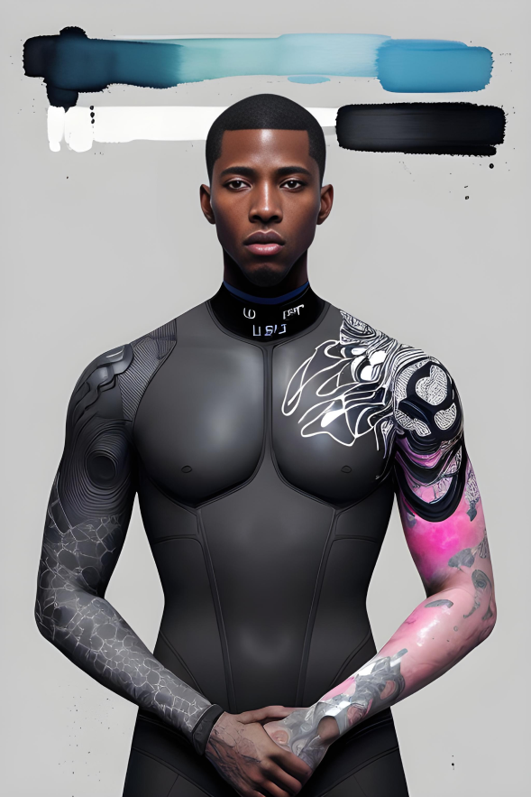

Title: Riding the Wave: Surfing's Subculture and Influence on Mainstream Pop Culture

Introduction:
Surfing, a sport rooted in the connection between humans and the ocean, has given rise to a vibrant and influential subculture. This essay explores the unique subculture of surfing, examining its history, values, and distinctive characteristics. Moreover, it delves into surfing's profound influence on mainstream pop culture, exploring how it has shaped fashion, music, film, and art, and captivated audiences worldwide.

The Subculture of Surfing:
Surfing's subculture embodies a distinct way of life, with its own set of values and practices. Surfers foster a deep connection with nature, emphasizing environmental consciousness and a love for the ocean. A laid-back, carefree attitude pervades the subculture, reflecting a desire for freedom, adventure, and the pursuit of the perfect wave. Community and camaraderie play an integral role, with surfers forming tight-knit groups that share experiences, support, and a passion for riding waves.

Fashion and Style:
Surfing has had a profound impact on fashion and style, establishing trends that have permeated mainstream culture. Surf culture's relaxed, beach-inspired aesthetic has influenced clothing, accessories, and lifestyle choices. Brands such as Quiksilver, Roxy, and Billabong have brought the spirit of surfing to the fashion world, with surf-inspired designs and the incorporation of technical materials. From boardshorts and bikinis to graphic tees and flip-flops, surfing's fashion influence continues to be felt globally.

Music and Soundtracks:
Surfing's influence extends to the realm of music, with distinctive genres and soundtracks that capture the essence of the subculture. Surf rock emerged in the 1960s, characterized by upbeat guitar-driven melodies that mirrored the energetic and carefree spirit of riding waves. Artists like Dick Dale, The Beach Boys, and Jack Johnson have become synonymous with surf culture, providing the soundtrack to surfing's imagery and lifestyle. Moreover, surf-inspired music has influenced various genres, from punk to alternative, leaving an indelible mark on popular music.

Film and Media:
Surfing's visual appeal has made it a captivating subject for filmmakers, resulting in the creation of iconic surf films that have resonated with audiences worldwide. Movies like "The Endless Summer," "Point Break," and "Blue Crush" have brought the thrill and beauty of surfing to the silver screen, captivating both surf enthusiasts and mainstream viewers. These films not only showcase the athletic prowess of surfers but also convey the subculture's spirit of adventure and the pursuit of the perfect wave.

Art and Photography:
The art world has been deeply influenced by the aesthetics and imagery of surfing. Artists and photographers have sought to capture the essence of riding waves, showcasing the sublime beauty and power of the ocean. Surf art often depicts dynamic wave formations, vibrant colors, and the juxtaposition of human figures against the vastness of the ocean. This genre of art has gained recognition and appreciation beyond the surfing community, serving as a bridge between surf culture and mainstream art.

Mainstream Pop Culture:
Surfing's subculture has made a significant impact on mainstream pop culture, permeating various aspects of contemporary society. From fashion trends to music genres, films, and art, surfing's influence can be seen in the choices and preferences of a wide range of individuals worldwide. The carefree, adventurous spirit associated with surfing resonates with people seeking an escape from the pressures of modern life. Surfing's subculture has become an aspirational lifestyle choice, reflecting a desire for freedom, connection with nature, and a pursuit of personal fulfillment.

Conclusion:
Surfing's subculture has evolved into a powerful force, shaping and influencing mainstream pop culture in myriad ways. The sport's distinctive